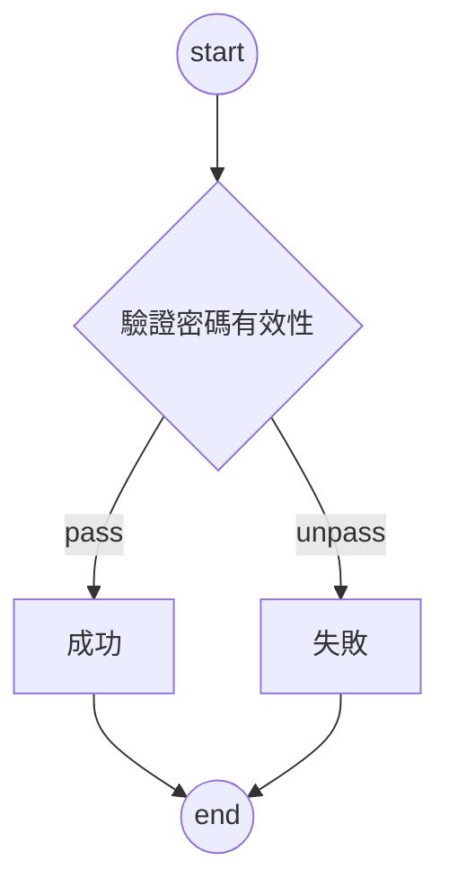

# API SPEC

密碼驗證API規格書

version: 1.0

[[_TOC_]]

## Changelog

| Date       | Version | Description             | Author     | Comment |
| ---------- | ------- | ----------------------- | ---------- | ------- |
| 2022/10/20 | 1.0     | initial version version | Gordan Kao |
## Common Objects

| Domain       | 欄位名稱     | 欄位說明 | 備註 | 欄位型別 | Man-datory | 範例    |
| ------------ | ------------ | -------- | ---- | -------- | ---------- | ------- |
| BaseResponse | code         | API結果  |      | String   | M          | 000     |
|              | message      | API訊息  |      | string   | M          | success |
|              | resultEntity | 回傳物件 |      | Object   |            |         |

| Domain      | 欄位名稱      | 欄位說明     | 備註           | 欄位型別 | Man-datory | 範例 |
| ----------- | ------------- | ------------ | -------------- | -------- | ---------- | ---- |
| BaseRequest | bpId          | 交易流水號   | 可使用UUID產生 | String   | M          |      |
|             | requestEntity | 傳入參數物件 |                | Object   |            |      |

### Code
  | code | description          |
  | ---- | -------------------- |
  | 000  | success              |
  | 002  | success with warning |
  | 900  | fail                 |
  | 999  | error                |

## APIs

Baseurl:
http://localhost:8080/api/


| No       | API ID   | Service Name    | Operation Name                         | Description    | Method | 更新日期     (yyyy/mm/dd) |
| -------- | -------- | --------------- | -------------------------------------- | -------------- | ------ | ------------------------- |
| 範例說明 | API  ID  | (Service  Name) | (API  Name)                            | API  說明      | Method | 每次更新須註明            |
| 1        | demo-001 | demo            | [validatePassword](#validate-password) | 驗證密碼正確性 | POST   | 2022/10/20                |

### Validate Password

驗證密碼正確性




- URL:
  /coupon

- METHOD:
  GET

- Request:

  | Domain                        | 欄位名稱 | 欄位說明 | 備註 | 欄位型別 | Man-datory | 範例 |
  | ----------------------------- | -------- | -------- | ---- | -------- | ---------- | ---- |
  | ValidatePasswordRequestEntity | password | 密碼     |      | string   | M          |      |
  

- Response:

  | Domain                      | 欄位名稱  | 欄位說明     | 備註                      | 欄位型別           | Man-datory | 範例                     |
  | --------------------------- | --------- | ------------ | ------------------------- | ------------------ | ---------- | ------------------------ |
  | ValidateServiceResultEntity | checkPass | 最終驗證結果 | true: pass, false: unpass | boolean            | M          | false                    |
  |                             | details   | 驗證詳細內容 |                           | List<ResultDetail> |            |                          |
  | ResultDetail                | stage     | 驗證關卡     |                           | String             |            | .*(\\w+)\\1.* == false ? |
  |                             | checkPass | 關卡驗證結果 |                           | boolean            |            | false                    |
  

- Sample:

input
```shell
curl --location --request POST 'http://localhost:8080/api/validatePassword' \
--header 'Content-Type: application/json' \
--data-raw '{
    "requestEntity": {
        "password": "123456abc"
    }
}'
```
output
```json
{
    "code": "000",
    "message": "success",
    "resultEntity": {
        "checkPass": true,
        "details": [
            {
                "stage": "[0-9a-z]{5,12} == true ?",
                "checkPass": true
            },
            {
                "stage": ".*[0-9].* == true ?",
                "checkPass": true
            },
            {
                "stage": ".*[a-z].* == true ?",
                "checkPass": true
            },
            {
                "stage": ".*(\\w+)\\1.* == false ?",
                "checkPass": true
            }
        ]
    }
}
```

[back to APIs](#apis)

###### tags: `DEMO`